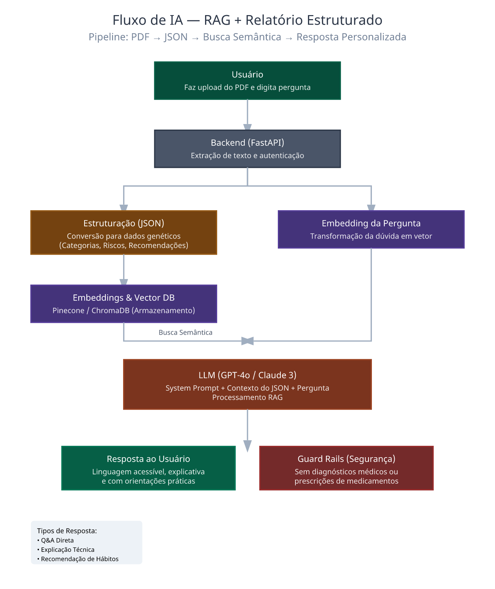

# FIAP - Faculdade de Informática e Administração Paulista

<p align="center">
<a href= "https://www.fiap.com.br/"></a>
</p>

<br>
---

# Projeto Dasa Genera - Sprint 1
### Transformando relatórios genéticos em uma experiência inteligente e interativa

---

## EQUIPE FIAP 
## 👨‍🎓 Integrantes: 

| Nome | RM | Contribuição |
|---|---:|---|
| Tayná Esteves | RM562491 | Product Owner / Negócio |
| João | RM565999 | Engenheiro de Dados (PDF → Estrutura) |
| Carlos Eduardo | RM566487 | Especialista em IA |
| Endrew Alves | RM563646 | Arquiteto + Front-end |

## 👩‍🏫 Professores:
### Tutor(a) 
- <a href="https://www.linkedin.com/in/john-paul-lima/">JOHN PAUL LIMA</a>
### Coordenador(a)
- <a href="https://www.linkedin.com/in/andregodoichiovato/">ANDRÉ GODOI CHIOVATO</a>


## 1. Problema

Os relatórios genéticos do produto Genera, da Dasa, concentram informações extremamente valiosas sobre saúde, como predisposição a doenças e características genéticas.

No entanto, esses dados são entregues em formato PDF, com grande volume de conteúdo e linguagem altamente técnica.

Isso gera uma barreira crítica: o usuário possui acesso à informação, mas não consegue compreendê-la plenamente — e, principalmente, não consegue transformá-la em decisões práticas sobre sua saúde.

Além disso, o modelo atual é totalmente estático: não permite interação, esclarecimento de dúvidas ou aprofundamento nos dados.

O resultado é um desalinhamento entre o potencial do dado gerado e o valor percebido pelo usuário.

---

## 2. Contexto do Produto Genera

O Genera é um serviço da Dasa que utiliza análise de DNA para fornecer insights personalizados sobre saúde, ancestralidade e predisposições genéticas.

Apesar da complexidade e relevância desses dados, a entrega atual ocorre por meio de relatórios em PDF não estruturados, o que limita significativamente a experiência do usuário.

Em um cenário onde dados são cada vez mais centrais na tomada de decisão, a ausência de uma camada interpretativa e interativa reduz o impacto do produto.

Dessa forma, surge a necessidade de transformar dados técnicos em conhecimento acessível, útil e acionável.

---

## 3. Solução Proposta

A solução proposta consiste na criação de uma camada inteligente baseada em Inteligência Artificial, capaz de transformar relatórios genéticos em uma experiência interativa e compreensível.

O sistema será responsável por:

- Processar o PDF e extrair suas informações
- Estruturar os dados de forma organizada
- Interpretar os resultados com apoio de IA
- Traduzir conteúdos técnicos para linguagem acessível
- Permitir interação por meio de perguntas e respostas
- Gerar recomendações personalizadas com base nos dados analisados

Dessa forma, o sistema deixa de ser apenas um repositório de informação e passa a atuar como um assistente inteligente de saúde, capaz de apoiar o usuário na compreensão e tomada de decisão.

---

## 4. Usuários

### Paciente
Busca compreender seu relatório genético de forma clara, entender riscos e receber orientações práticas.

### Médico
Precisa de uma visualização rápida e estruturada dos dados para apoiar decisões clínicas.

### Dasa / Laboratório
Busca melhorar a experiência do usuário, aumentar o valor percebido do produto e fortalecer sua posição como empresa orientada a dados.

---

## 5. User Stories

1. Como paciente, quero entender meu relatório genético em linguagem simples, para saber o que ele significa na prática.
2. Como paciente, quero fazer perguntas sobre meu exame, para esclarecer dúvidas específicas sobre meus resultados.
3. Como paciente, quero receber recomendações personalizadas, para tomar decisões preventivas com base nos meus dados.
4. Como médico, quero visualizar rapidamente os principais riscos do paciente, para otimizar minha análise.
5. Como usuário, quero acessar meus dados de forma organizada, para facilitar a interpretação e acompanhamento.

---

## 6. Valor Gerado

A solução transforma dados complexos em conhecimento acessível e aplicável.

Para o paciente, representa autonomia e clareza na compreensão da própria saúde.
Para o médico, agilidade e suporte na análise de dados.
Para a Dasa, inovação no produto e aumento do valor percebido pelo cliente.

Mais do que apresentar informações, a solução entrega entendimento, interação e orientação.

### Visão de Produto

Nosso objetivo não é apenas interpretar um relatório em PDF.

Queremos transformar dados genéticos em uma experiência inteligente, acessível e orientada à decisão, aproximando o usuário do entendimento real da sua própria saúde.

---

## 7. Estruturação dos Dados

Após o upload do relatório genético em PDF, o sistema deverá extrair as informações relevantes e organizá-las em um formato estruturado. A proposta é converter os dados do PDF para um formato JSON, separando informações como categoria, condição analisada, nível de risco, descrição e recomendação.

### 🧪 Exemplo de JSON

```json
{
  "paciente": {
    "id": "PAC001",
    "nome": "Paciente Exemplo",
    "idade": 32
  },
  "relatorio": {
    "produto": "Genera",
    "tipo": "Relatório Genético",
    "data_emissao": "2026-04-30"
  },
  "resultados": [
    {
      "categoria": "Saúde",
      "condicao": "Diabetes tipo 2",
      "nivel_risco": "Alto",
      "descricao": "Predisposição genética elevada para diabetes tipo 2.",
      "recomendacao": "Manter hábitos saudáveis e acompanhamento médico."
    },
    {
      "categoria": "Nutrição",
      "condicao": "Intolerância à Lactose",
      "nivel_risco": "Moderado",
      "descricao": "Variante genética associada à redução da produção de lactase após a infância.",
      "recomendacao": "Avaliar consumo de laticínios e considerar alternativas vegetais."
    },
    {
      "categoria": "Saúde Cardiovascular",
      "condicao": "Hipertensão",
      "nivel_risco": "Baixo",
      "descricao": "Predisposição genética reduzida para hipertensão arterial.",
      "recomendacao": "Manter estilo de vida ativo e dieta equilibrada como prevenção."
    }
  ]
}
```

### Campos Mapeados

| Campo | Descrição |
|---|---|
| `paciente` | Informações de identificação do usuário |
| `relatorio` | Metadados do exame (produto, tipo, data) |
| `resultados` | Lista de análises genéticas identificadas |
| `categoria` | Área de saúde analisada (ex: Saúde, Nutrição) |
| `condicao` | Condição genética avaliada |
| `nivel_risco` | Classificação do risco: Baixo / Moderado / Alto |
| `descricao` | Explicação simplificada da condição |
| `recomendacao` | Orientação inicial personalizada |

---

## 8. Inteligência Artificial

> **Especialista em IA**

A Inteligência Artificial é o núcleo da solução, responsável por transformar dados genéticos estruturados em respostas claras, personalizadas e úteis para o usuário. Diferente de abordagens tradicionais, a IA não trabalha diretamente com o PDF bruto, mas sim com dados organizados em JSON, garantindo maior precisão, controle e confiabilidade nas respostas.

---

### 8.1 Estratégia de IA — Por que RAG?

A solução adota a abordagem **RAG (Retrieval-Augmented Generation)** como estratégia central de IA.

**Por que RAG e não um LLM puro?**

| Critério | LLM Puro | RAG (nossa escolha) |
|---|---|---|
| Responde com dados do usuário? | ❌ Não — usa apenas conhecimento geral | ✅ Sim — busca nos dados do próprio paciente |
| Risco de "alucinação"? | Alto | Reduzido — respostas ancoradas nos dados |
| Personalização? | Genérica | Alta — contexto individual de cada relatório |
| Confiabilidade em saúde? | Baixa | Alta — rastreável até a fonte do dado |

A abordagem RAG garante que **cada resposta seja baseada no relatório real do usuário**, eliminando generalizações inadequadas para dados de saúde sensíveis.

---

### 8.2 Stack Tecnológica de IA

| Componente | Tecnologia Proposta | Justificativa |
|---|---|---|
| Modelo LLM | GPT-4o (OpenAI) ou Claude 3 Sonnet | Alto desempenho em linguagem natural e contexto médico |
| Embeddings | `text-embedding-3-small` (OpenAI) | Custo-benefício eficiente para vetorização de JSON |
| Vector Database | Pinecone ou ChromaDB | Busca semântica rápida e escalável |
| Orquestração RAG | LangChain ou LlamaIndex | Frameworks maduros para pipeline RAG |
| Backend API | Python (FastAPI) | Leve, rápido e compatível com LangChain |

---

### 8.3 Integração da IA no Pipeline

O pipeline abaixo detalha como a pergunta do usuário e os dados estruturados do relatório convergem através da arquitetura RAG (Retrieval-Augmented Generation) para gerar uma resposta segura e personalizada.

Fluxo Geral de Processamento:

Upload: O usuário envia o relatório em PDF.

Backend: Extração de texto e estruturação em JSON.

Vetorização: Geração de embeddings e armazenamento em Vector Database (Pinecone/ChromaDB).

Interação: O usuário faz uma pergunta que é comparada semanticamente com os dados do relatório.

LLM: O modelo (GPT-4o/Claude) recebe o contexto específico e gera a resposta.



```
Usuário
   ↓
Upload de PDF (Front-end)
   ↓
API Backend (FastAPI)
   ↓
Extração de Texto (pdfplumber / OCR)
   ↓
Estruturação em JSON
   ↓
Armazenamento (banco relacional)
   ↓
Geração de Embeddings (text-embedding-3-small)
   ↓
Vector Database (Pinecone / ChromaDB)
   ↓
[Pergunta do Usuário] → Busca Semântica → Contexto Relevante
   ↓
LLM + RAG (GPT-4o / Claude)
   ↓
Resposta Inteligente (linguagem natural, segura e personalizada)
   ↓
Interface (Chat + Dashboard)
```

---

### 8.4 Entrada e Saída da IA

**Entrada:**
- Dados estruturados em JSON (gerados pelo Engenheiro de Dados)
- Embeddings armazenados no banco vetorial
- Pergunta do usuário em linguagem natural

**Processamento:**
1. A pergunta do usuário é convertida em embedding
2. O sistema realiza busca semântica no banco vetorial para recuperar os trechos mais relevantes do relatório
3. O contexto recuperado é enviado junto com a pergunta ao modelo LLM
4. O LLM gera uma resposta contextualizada, clara e segura

**Saída:**
- Resposta em linguagem acessível (não técnica)
- Explicação do resultado genético
- Recomendação personalizada (quando aplicável)
- Indicação para consulta profissional (sempre que pertinente)

---

### 8.5 Tipos de Interação Suportados

O sistema suporta três tipos de interação com o usuário:

| Tipo | Descrição | Exemplo |
|---|---|---|
| **Explicação** | Traduz termos técnicos para linguagem simples | "O que é predisposição genética?" |
| **Consulta** | Responde perguntas sobre os próprios dados | "Eu tenho risco de diabetes?" |
| **Recomendação** | Sugere ações preventivas baseadas nos resultados | "O que posso fazer para proteger minha saúde?" |

---

### 8.6 Exemplos de Interação (Fluxo Pergunta → Resposta)

---

**Exemplo 1 — Consulta direta sobre risco**

> 👤 Usuário: *"Eu tenho risco de diabetes?"*

> 🤖 IA: *"Sim. De acordo com seu relatório genético, você apresenta **alto risco** para Diabetes tipo 2. Isso significa que sua composição genética inclui variantes associadas a uma maior predisposição ao desenvolvimento dessa condição ao longo da vida.*
>
> *Importante: predisposição genética não significa certeza de desenvolver a doença. Hábitos de vida têm grande influência. Recomenda-se manter uma alimentação equilibrada, praticar atividades físicas regularmente e realizar acompanhamento médico periódico."*

---

**Exemplo 2 — Explicação de termo técnico**

> 👤 Usuário: *"O que significa intolerância à lactose no meu exame?"*

> 🤖 IA: *"Seu relatório identificou uma variante genética associada à **redução da produção de lactase** — a enzima responsável por digerir o açúcar presente no leite (lactose).*
>
> *Na prática, isso pode significar que você sente desconforto digestivo ao consumir laticínios, como inchaço ou náusea. Muitas pessoas com essa variante convivem bem reduzindo o consumo de leite ou optando por versões sem lactose. Converse com um nutricionista para avaliar sua dieta."*

---

**Exemplo 3 — Pedido de recomendação geral**

> 👤 Usuário: *"Com base no meu relatório, o que devo fazer para cuidar da minha saúde?"*

> 🤖 IA: *"Com base nos seus resultados, aqui estão as principais orientações personalizadas:*
>
> *🔴 **Atenção prioritária:** Diabetes tipo 2 (risco Alto) — adote uma rotina de exercícios e evite dietas ricas em açúcar.*
> *🟡 **Atenção moderada:** Intolerância à Lactose (risco Moderado) — avalie o consumo de laticínios.*
> *🟢 **Ponto positivo:** Hipertensão (risco Baixo) — continue mantendo hábitos saudáveis.*
>
> *Lembre-se: essas orientações são baseadas em seu perfil genético e têm caráter informativo. Consulte um médico para um acompanhamento personalizado."*

---

**Exemplo 4 — Pergunta fora do escopo (guard rail ativo)**

> 👤 Usuário: *"Qual remédio devo tomar para diabetes?"*

> 🤖 IA: *"Essa é uma pergunta importante, mas que está fora do meu escopo. Não tenho autorização para recomendar medicamentos — isso é responsabilidade exclusiva de um profissional de saúde habilitado.*
>
> *O que posso fazer é ajudá-lo a entender seus resultados genéticos e orientá-lo sobre hábitos preventivos. Para indicação de tratamentos, por favor consulte seu médico."*

---

### 8.7 Camada de Interpretação Inteligente

Além de responder perguntas, a IA interpreta o contexto dos dados do usuário, permitindo que o sistema:

- Explique o impacto dos resultados na vida cotidiana do usuário
- Adapte a linguagem conforme o perfil (paciente leigo vs. médico)
- Evite alarmismo desnecessário ao contextualizar riscos genéticos
- Priorize recomendações seguras, informativas e não prescritivas

---

### 8.8 Guard Rails — Segurança e Uso Responsável da IA

Por se tratar de dados sensíveis de saúde, o sistema adota regras rígidas de uso responsável:

| Regra | Descrição |
|---|---|
| ✅ Sem diagnósticos | A IA nunca afirma que o usuário "tem" uma doença |
| ✅ Sem prescrições | A IA nunca recomenda medicamentos ou tratamentos clínicos |
| ✅ Encaminhamento profissional | Toda resposta relevante inclui recomendação de consulta médica |
| ✅ Respostas rastreáveis | Toda resposta é baseada nos dados do próprio relatório do usuário |
| ✅ Linguagem responsável | Riscos são apresentados com contexto, sem alarmismo |
| ✅ Recusa de perguntas fora do escopo | O sistema recusa perguntas que extrapolam informação genética |

---

### 8.9 Diferencial da Solução de IA

O principal diferencial desta abordagem é que a IA **não apenas responde perguntas genéricas** — ela responde com base nos dados reais do relatório de cada usuário, garantindo personalização, precisão e responsabilidade.

> Em outras palavras: a IA transforma dados genéticos em orientação compreensível, segura e contextualizada para cada pessoa.

---

## 🏗️ Arquitetura da Solução

### 🧱 Diagrama da Arquitetura


### Pipeline Geral

```
Usuário
   ↓
Upload de PDF (Front-end)
   ↓
API Backend
   ↓
Extração de Texto (PDF/OCR)
   ↓
Estruturação em JSON
   ↓
Armazenamento
   ↓
Embeddings
   ↓
Vector Database
   ↓
LLM + RAG
   ↓
Resposta Inteligente
   ↓
Interface (Chat + Dashboard)
```

### Explicação de Cada Etapa

**Upload:** O usuário envia o relatório genético em PDF por meio da interface web da aplicação.

**Processamento:** O backend recebe o arquivo e realiza a extração de texto, utilizando técnicas de leitura de PDF e, quando necessário, OCR para conteúdos não estruturados.

**Estruturação:** Os dados extraídos passam por um processo de limpeza e organização, sendo convertidos para JSON com campos como condição, nível de risco, descrição e recomendação.

**Inteligência Artificial:** Os dados estruturados são transformados em embeddings e armazenados em um banco vetorial. Quando o usuário faz uma pergunta, o sistema realiza busca semântica e utiliza LLM + RAG para gerar uma resposta contextualizada.

**Interface:** O usuário interage com o sistema por meio de um dashboard e um assistente inteligente (chatbot), podendo visualizar seus dados e fazer perguntas em linguagem natural.

---

## Interface do Usuário (UX)

A interface da solução foi projetada para ser simples, intuitiva e acessível, permitindo que qualquer usuário — mesmo sem conhecimento técnico — consiga compreender seus dados genéticos com clareza.

### Estrutura da Interface

**1. Tela de Upload**
- Permite o envio do relatório genético em PDF
- Exibe instruções claras para o usuário
- Inicia automaticamente o processamento do arquivo
- Indica status do processamento (ex: "analisando dados…")

**2. Dashboard de Resultados**
- Apresenta os dados organizados por categorias (ex: saúde, bem-estar)
- Exibe o nível de risco de forma visual (baixo, moderado, alto)
- Mostra explicações simplificadas para cada condição
- Destaca recomendações iniciais com base nos resultados
- Permite navegação entre diferentes análises do relatório

**3. Assistente Inteligente (Chatbot)**
- Permite que o usuário faça perguntas em linguagem natural
- Utiliza a IA (LLM + RAG) para gerar respostas personalizadas
- Exibe respostas claras, contextualizadas e seguras
- Mantém histórico de interação para acompanhamento

### Jornada do Usuário

1. O usuário acessa a plataforma
2. Realiza o upload do seu relatório genético
3. O sistema processa o arquivo e estrutura os dados automaticamente
4. O usuário visualiza os resultados no dashboard
5. Pode interagir com o assistente para esclarecer dúvidas e aprofundar o entendimento
6. Recebe orientações baseadas em seus próprios dados

### Princípios de Experiência

- **Clareza:** linguagem simples e acessível
- **Acessibilidade:** conteúdo compreensível para usuários leigos
- **Interatividade:** possibilidade de explorar os dados com perguntas
- **Organização:** estrutura visual que facilita leitura e entendimento
- **Confiança:** apresentação responsável de dados sensíveis de saúde

---

## 🔐 Governança de Dados

Por lidar com informações genéticas — dados altamente sensíveis — a solução adota práticas rigorosas de proteção e privacidade:

- **Privacidade:** dados do paciente armazenados com criptografia; nenhuma informação pessoal é compartilhada com terceiros
- **LGPD:** o sistema respeita os princípios da Lei Geral de Proteção de Dados, garantindo consentimento informado e direito de exclusão
- **Anonimização:** dados utilizados para testes e desenvolvimento são anonimizados
- **Acesso restrito:** cada usuário acessa apenas seu próprio relatório
- **Guard Rails de IA:** conforme descrito na seção 8.8, a IA opera com regras rígidas de uso responsável

---

## 🚀 Próximos Passos — Sprint 2

Na próxima sprint, o grupo pretende evoluir da proposta conceitual para a implementação inicial:

| Entrega | Descrição |
|---|---|
| Extração real de PDF | Implementar pipeline de leitura com `pdfplumber` e OCR |
| Estruturação automatizada | Script Python para converter texto extraído em JSON |
| Protótipo de RAG | Configurar LangChain + ChromaDB com dados simulados |
| Interface básica | Tela de upload e exibição dos dados estruturados |
| Testes de interação | Validar respostas da IA com perguntas reais sobre o relatório |

---

## Conclusão

Este projeto propõe uma solução completa para um problema relevante no contexto da saúde digital: a dificuldade de interpretação de relatórios genéticos técnicos por parte dos usuários.

A solução combina processamento de dados, Inteligência Artificial com abordagem RAG e uma interface centrada no usuário para transformar informações complexas em conhecimento acessível e aplicável.

Por meio da estruturação dos dados em JSON e da utilização de modelos de linguagem com busca semântica, o sistema permite interpretar resultados, responder perguntas personalizadas e oferecer orientações responsáveis — sempre ancoradas nos dados reais do paciente.

A arquitetura garante integração entre os componentes, os guard rails garantem uso seguro da IA, e a interface promove uma experiência intuitiva e confiável.

Como evolução futura, a solução pode incluir integração com profissionais de saúde, monitoramento contínuo e expansão para outros produtos diagnósticos da Dasa.

---

> 📹 **Vídeo de apresentação:** *(link a ser adicionado)*


