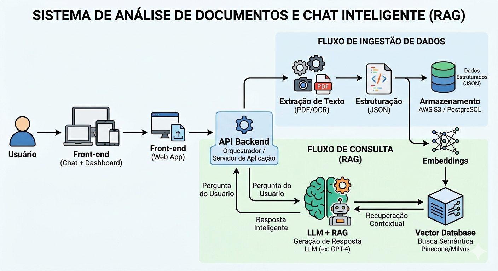

# Projeto Dasa Genera - Sprint 1  
### Transformando relatórios genéticos em uma experiência inteligente e interativa

## 1. Problema

Os relatórios genéticos do produto Genera, da Dasa, concentram informações extremamente valiosas sobre saúde, como predisposição a doenças e características genéticas.

No entanto, esses dados são entregues em formato PDF, com grande volume de conteúdo e linguagem altamente técnica.

Isso gera uma barreira crítica: o usuário possui acesso à informação, mas não consegue compreendê-la plenamente — e, principalmente, não consegue transformá-la em decisões práticas sobre sua saúde.

Além disso, o modelo atual é totalmente estático: não permite interação, esclarecimento de dúvidas ou aprofundamento nos dados.

O resultado é um desalinhamento entre o potencial do dado gerado e o valor percebido pelo usuário.

---

## 2. Contexto do Produto Genera

O Genera é um serviço da Dasa que utiliza análise de DNA para fornecer insights personalizados sobre saúde, ancestralidade e predisposições genéticas.

Apesar da complexidade e relevância desses dados, a entrega atual ocorre por meio de relatórios em PDF não estruturados, o que limita significativamente a experiência do usuário.

Em um cenário onde dados são cada vez mais centrais na tomada de decisão, a ausência de uma camada interpretativa e interativa reduz o impacto do produto.

Dessa forma, surge a necessidade de transformar dados técnicos em conhecimento acessível, útil e acionável.

---

## 3. Solução Proposta

A solução proposta consiste na criação de uma camada inteligente baseada em Inteligência Artificial, capaz de transformar relatórios genéticos em uma experiência interativa e compreensível.

O sistema será responsável por:

- Processar o PDF e extrair suas informações  
- Estruturar os dados de forma organizada  
- Interpretar os resultados com apoio de IA  
- Traduzir conteúdos técnicos para linguagem acessível  
- Permitir interação por meio de perguntas e respostas  
- Gerar recomendações personalizadas com base nos dados analisados  

Dessa forma, o sistema deixa de ser apenas um repositório de informação e passa a atuar como um assistente inteligente de saúde, capaz de apoiar o usuário na compreensão e tomada de decisão.

##  4. Usuários

###  Paciente
Busca compreender seu relatório genético de forma clara, entender riscos e receber orientações práticas.

### Médico
Precisa de uma visualização rápida e estruturada dos dados para apoiar decisões clínicas.

###  Dasa / Laboratório
Busca melhorar a experiência do usuário, aumentar o valor percebido do produto e fortalecer sua posição como empresa orientada a dados.

---

##  5. User Stories

1. Como paciente, quero entender meu relatório genético em linguagem simples, para saber o que ele significa na prática.  
2. Como paciente, quero fazer perguntas sobre meu exame, para esclarecer dúvidas específicas sobre meus resultados.  
3. Como paciente, quero receber recomendações personalizadas, para tomar decisões preventivas com base nos meus dados.  
4. Como médico, quero visualizar rapidamente os principais riscos do paciente, para otimizar minha análise.  
5. Como usuário, quero acessar meus dados de forma organizada, para facilitar a interpretação e acompanhamento.  

---

## 6. Valor Gerado

A solução transforma dados complexos em conhecimento acessível e aplicável.

Para o paciente, representa autonomia e clareza na compreensão da própria saúde.  
Para o médico, agilidade e suporte na análise de dados.  
Para a Dasa, inovação no produto e aumento do valor percebido pelo cliente.

Mais do que apresentar informações, a solução entrega entendimento, interação e orientação.

## Visão de Produto

Nosso objetivo não é apenas interpretar um relatório em PDF.

Queremos transformar dados genéticos em uma experiência inteligente, acessível e orientada à decisão, aproximando o usuário do entendimento real da sua própria saúde.

## 7. Estruturação dos Dados

Após o upload do relatório genético em PDF, o sistema deverá extrair as informações relevantes e organizá-las em um formato estruturado.

A proposta é converter os dados do PDF para um formato JSON, separando informações como categoria, condição analisada, nível de risco, descrição e recomendação.

Essa estrutura permite que a Inteligência Artificial utilize os dados de forma mais precisa para gerar explicações, respostas e recomendações personalizadas.

### 🧪 Exemplo de JSON

```json
{
  "paciente": {
    "id": "PAC001",
    "nome": "Paciente Exemplo",
    "idade": 32
  },
  "relatorio": {
    "produto": "Genera",
    "tipo": "Relatório Genético",
    "data_emissao": "2026-04-30"
  },
  "resultados": [
    {
      "categoria": "Saúde",
      "condicao": "Diabetes tipo 2",
      "nivel_risco": "Alto",
      "descricao": "Predisposição genética elevada para diabetes tipo 2.",
      "recomendacao": "Manter hábitos saudáveis e acompanhamento médico."
    }
  ]
}
```


### Campos Mapeados

- **paciente:** informações do usuário  
- **relatorio:** dados do exame  
- **resultados:** lista de análises  
- **categoria:** área analisada  
- **condicao:** condição genética  
- **nivel_risco:** classificação  
- **descricao:** explicação simplificada  
- **recomendacao:** orientação inicial  

## 8. Inteligência Artificial

A Inteligência Artificial é o núcleo da solução, responsável por transformar dados genéticos estruturados em respostas claras, personalizadas e úteis para o usuário.

Diferente de abordagens tradicionais, a IA não trabalha diretamente com o PDF bruto, mas sim com dados organizados, garantindo maior precisão, controle e confiabilidade nas respostas.

---

### Integração da IA no Pipeline

A IA está integrada ao fluxo completo da solução, conforme o pipeline abaixo:

Usuário  
↓  
Upload de PDF (Front-end)  
↓  
API Backend  
↓  
Extração de Texto (PDF/OCR)  
↓  
Estruturação em JSON  
↓  
Armazenamento  
↓  
Geração de Embeddings  
↓  
Vector Database  
↓  
LLM + RAG  
↓  
Resposta Inteligente  
↓  
Interface (Chat + Dashboard)  

---

### Estratégia de IA (RAG)

A solução utiliza uma abordagem baseada em RAG (Retrieval-Augmented Generation).

Nesse modelo:

1. Os dados estruturados do relatório são convertidos em embeddings;
2. Esses embeddings são armazenados em um banco vetorial (vector database);
3. Quando o usuário faz uma pergunta, o sistema busca as informações mais relevantes nesse banco;
4. O modelo de linguagem (LLM) utiliza esses dados para gerar uma resposta contextualizada e precisa.

Dessa forma, as respostas são baseadas diretamente nos dados do próprio usuário, evitando generalizações e aumentando a confiabilidade da solução.

---

### Interação com o Usuário

O sistema permite interação por meio de linguagem natural, com perguntas como:

- "Eu tenho risco de diabetes?"
- "O que significa intolerância à lactose?"
- "O que posso fazer para melhorar minha saúde?"

A IA interpreta a pergunta, recupera os dados relevantes e gera uma resposta clara, personalizada e de fácil entendimento.

---

### Entrada e Saída da IA

**Entrada:**
- Dados estruturados (JSON)
- Embeddings armazenados
- Pergunta do usuário

**Processamento:**
- Busca semântica no banco vetorial
- Interpretação com modelo de linguagem (LLM)

**Saída:**
- Resposta em linguagem simples
- Explicação do resultado
- Recomendação personalizada (quando aplicável)

---

###  Camada de Interpretação Inteligente
Além de responder perguntas, a IA interpreta o contexto dos dados do usuário.

Isso permite que o sistema:

- Explique o impacto dos resultados na vida do usuário;
- Adapte a linguagem conforme o nível de conhecimento;
- Evite alarmismo desnecessário;
- Priorize recomendações seguras e responsáveis.

---

###  Guard Rails (Segurança da IA)

Por se tratar de dados sensíveis de saúde, o sistema adota regras de uso responsável:

- Não realiza diagnósticos médicos;
- Sempre recomenda acompanhamento profissional;
- Evita recomendações críticas sem validação;
- Garante que as respostas sejam informativas e não prescritivas.

---

###  Exemplo de Interação

**Pergunta do usuário:**  
"Eu tenho risco de diabetes?"

**Resposta da IA:**  
"Sim, de acordo com seu relatório genético, você apresenta alto risco para diabetes tipo 2. Isso indica uma predisposição genética para o desenvolvimento da condição.

Recomenda-se manter uma alimentação equilibrada, praticar atividades físicas regularmente e buscar acompanhamento médico preventivo."

---

###  Diferencial da Solução

O principal diferencial da IA proposta é que ela não apenas responde perguntas, mas transforma dados genéticos em orientação compreensível, segura e contextualizada.

Dessa forma, a solução atua como um apoio inteligente à tomada de decisão em saúde.

## 🏗️ Arquitetura da Solução

### 🧱 Diagrama da Arquitetura


###  Pipeline Geral

Usuário 
↓ 
Upload de PDF (Front-end) 
↓ 
API Backend 
↓ 
Extração de Texto (PDF/OCR) 
↓ 
Estruturação em JSON 
↓ 
Armazenamento 
↓ 
Embeddings 
↓ 
Vector Database 
↓ 
LLM + RAG 
↓ 
Resposta Inteligente 
↓ 
Interface (Chat + Dashboard)

---

## Explicação do Pipeline

### Upload
O usuário envia o relatório genético em formato PDF por meio da interface web da aplicação.

---

### Processamento
O backend recebe o arquivo e realiza a extração de texto, utilizando técnicas de leitura de PDF e, quando necessário, OCR para conteúdos não estruturados.

---

### Estruturação
Os dados extraídos passam por um processo de limpeza e organização, sendo convertidos para um formato estruturado (JSON), com campos como condição, nível de risco, descrição e recomendação.

---

### Inteligência Artificial
Os dados estruturados são transformados em embeddings e armazenados em um banco vetorial.

Quando o usuário faz uma pergunta, o sistema realiza uma busca semântica nesses dados e utiliza um modelo de linguagem (LLM + RAG) para gerar uma resposta contextualizada e personalizada.

---

### Interface

O usuário interage com o sistema por meio de um dashboard e um assistente inteligente (chatbot), podendo visualizar seus dados e fazer perguntas em linguagem natural.

---

##  Interface do Usuário (UX)

A interface da solução foi projetada para ser simples, intuitiva e acessível, permitindo que qualquer usuário — mesmo sem conhecimento técnico — consiga compreender seus dados genéticos com clareza.

A aplicação será baseada em uma interface web, integrada ao pipeline de processamento e à camada de Inteligência Artificial.

---

### Estrutura da Interface

A solução é composta por três áreas principais:

####  1. Tela de Upload
- Permite o envio do relatório genético em PDF;
- Exibe instruções claras para o usuário;
- Inicia automaticamente o processamento do arquivo;
- Indica status do processamento (ex: “analisando dados…”).

---

####  2. Dashboard de Resultados
- Apresenta os dados organizados por categorias (ex: saúde, bem-estar);
- Exibe o nível de risco de forma visual (baixo, moderado, alto);
- Mostra explicações simplificadas para cada condição;
- Destaca recomendações iniciais com base nos resultados;
- Permite navegação entre diferentes análises do relatório.

---

####  3. Assistente Inteligente (Chatbot)
- Permite que o usuário faça perguntas em linguagem natural;
- Utiliza a IA (LLM + RAG) para gerar respostas personalizadas;
- Exibe respostas claras, contextualizadas e seguras;
- Mantém histórico de interação para acompanhamento.

---

###  Jornada do Usuário

1. O usuário acessa a plataforma;
2. Realiza o upload do seu relatório genético;
3. O sistema processa o arquivo e estrutura os dados automaticamente;
4. O usuário visualiza os resultados no dashboard;
5. Pode interagir com o assistente para esclarecer dúvidas e aprofundar o entendimento;
6. Recebe orientações baseadas em seus próprios dados.

---

###  Princípios de Experiência

A interface foi projetada com foco em:

- **Clareza:** linguagem simples e acessível  
- **Acessibilidade:** conteúdo compreensível para usuários leigos  
- **Interatividade:** possibilidade de explorar os dados com perguntas  
- **Organização:** estrutura visual que facilita leitura e entendimento  
- **Confiança:** apresentação responsável de dados sensíveis de saúde  

---

### Diferencial da Interface

O principal diferencial da interface é transformar um relatório técnico e estático em uma experiência interativa e centrada no usuário.

Ao invés de apenas visualizar informações, o usuário consegue compreender, explorar e agir com base nos seus dados genéticos, com apoio de uma Inteligência Artificial contextualizada e segura.

## Conclusão

Este projeto propõe uma solução para um problema relevante no contexto da saúde digital: a dificuldade de interpretação de relatórios genéticos técnicos por parte dos usuários.

A solução combina processamento de dados, Inteligência Artificial e experiência do usuário para transformar informações complexas em conhecimento acessível e aplicável.

Por meio da estruturação dos dados e da utilização de modelos de linguagem com abordagem RAG, o sistema permite interpretar resultados, responder perguntas e oferecer orientações personalizadas de forma clara e responsável.

A arquitetura garante integração entre os componentes, enquanto a interface promove uma experiência intuitiva e centrada no usuário.

Dessa forma, o projeto demonstra como a aplicação estratégica de Inteligência Artificial pode ampliar o valor de produtos baseados em dados, transformando relatórios estáticos em experiências inteligentes.

Como evolução futura, a solução pode incluir integração com profissionais de saúde e monitoramento contínuo, ampliando seu impacto no ecossistema digital.
